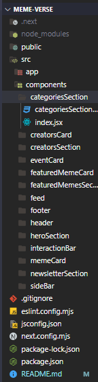

# Atividade Avaliativa Front-End: MemeVerse 🎭

Esta atividade avaliativa tem como objetivo aplicar os conceitos de componentização com props no framework Next.js 15, por meio do desenvolvimento de uma aplicação chamada MemeVerse — uma plataforma fictícia de compartilhamento de memes.


---

## **📋 Objetivo da Atividade**
Bem-vindo ao **MemeVerse**, uma plataforma de compartilhamento de memes desenvolvida com **Next.js 15**. Este projeto foi criado como parte de uma atividade avaliativa, com foco em **componentização**, **uso de props** e **CSS Modules** para estilização.

O objetivo do projeto é criar uma interface interativa e responsiva para o compartilhamento de memes, aplicando boas práticas de desenvolvimento frontend, como:

- Componentização com React.
- Uso de props para passagem de dados entre componentes.
- Estilização modular e responsiva com CSS Modules.

---

## **🛠️ Tecnologias Utilizadas**

- **Next.js 15**
- **CSS Modules**
- **JavaScript (ES6+)**

---

## **📂 Estrutura do Projeto**

O projeto está organizado da seguinte forma:



---

## **📦 Componentes Implementados**

### **1. Header**
- **Props utilizadas:**
  - `logo`
  - `navItems`

### **2. HeroSection**
- **Props utilizadas:**
  - `memeOfTheDay`

### **3. MemeCard**
- **Props utilizadas:**
  - `id`, `title`, `description`, `image`, `author`, `category`, `likes`, `comments`.

### **4. InteractionBar**
- **Props utilizadas:**
  - `likes`, `comments`.

### **5. CategoriesSection**
- **Props utilizadas:**
  - `categories`

### **6. Footer**
- **Props utilizadas:**
  - `footerData`
  - `socialLinks`

### **7. Sidebar**
- **Props utilizadas:**
  - `events`, `premiumFeatures`, `popularTags`.

---

## **🎨 Estilização**

- **CSS Modules:** Cada componente possui seu próprio arquivo `.module.css`, garantindo isolamento de estilos.
- **Responsividade:** Implementada com `@media` queries para diferentes tamanhos de tela:
  - **1024px:** Ajustes para tablets.
  - **768px:** Ajustes para dispositivos móveis.
  - **480px:** Ajustes para telas muito pequenas.

---

### **Pré-requisitos**

- Node.js (versão 16 ou superior)
- Gerenciador de pacotes `npm`

---

## **📈 Decisões de Design**
## Ordem do desenvolvimento

**Configuração inicial**
- Criação da pasta components/
- Aplicação do reset CSS
- Estrutura base da página principal

**Topo da Página**
- Header: Cabeçalho com navegação
- HeroSection: Seção de destaque inicial (banner)

**Conteúdo Principal**
- CategoriesSection: Exibição de categorias
- MemeCard, InteractionBar e Feed: Cards de memes com likes/comentários
- SideBar e EventCard: Conteúdos laterais e eventos

**Seções de Destaque**
- CreatorsCard e CreatorsSection: Destaque para criadores de conteúdo
- FeaturedMemeCard e FeaturedMemesSection: Memes em destaque

**Encerramento da Página**

-NewsletterSection: Seção de inscrição
-Footer: Rodapé com links e redes sociais

**Refatorações e Estilizações**
- Ajuste de props em vários componentes para melhor organização de dados
- Correção de chaves únicas (key) em listas
- Estilização adicional com CSS Modules
- Adição de responsividade em toda a página

- Componentização: Dividi a interface em componentes reutilizáveis para facilitar a manutenção e a escalabilidade.
- CSS Modules: Escolhido para garantir o isolamento de estilos, evitando conflitos entre componentes.
- Responsividade: Priorizada desde o início para garantir uma boa experiência de uso em diferentes tamanhos de tela, especialmente dispositivos móveis.

## **💡 Desafios e Soluções**
Desafio: Organização e integração de dados entre os componentes.

Solução: Utilização de props para passar dados de forma clara, direta e organizada, mantendo a estrutura do código mais limpa e flexível.

Após uma conversa com o instrutor Felipe Santos, consegui resolver algumas dúvidas e passei a ter menos dificuldades na integração das seções e na organização dos componentes. 

---

## **🚀 Como Executar o Projeto**

## 1. Clone o repositório:
   ```bash
   git clone https://github.com/seu-usuario/meme-verse.git
   ```

## 2. Acesse a pasta do projeto:
```bash
cd meme-verse
```

## 3. Instale as dependências:
```bash
npm install
```

## 4. Inicie o servidor de desenvolvimento:
```bash
npm run dev
```

## 5. Acesse o projeto no navegador:
```bash
http://localhost:3000

```
---

## 👩‍💻 Desenvolvido por
Maria Eduarda Reis Pereira
SENAI - Curso Desenvolvimento de Sistema
Atividade Avaliativa de Front-End